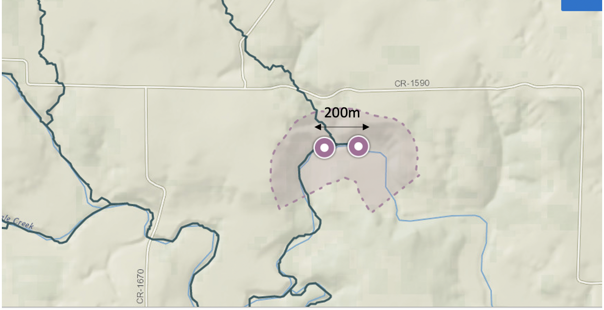

```{r setup, include=FALSE}
knitr::opts_chunk$set(echo = FALSE, 
                      message=FALSE, 
                      warning=FALSE, 
                      cache=TRUE, 
                      dev.args=list(bg=grey(0.9), 
                                    pointsize=11))
library(tidyverse)
library(lubridate)
library(knitr)
library(kableExtra)
```

```{r external, include = FALSE, cache = FALSE}
read_chunk(here::here("presentation", 
                      "scripts", "time-plots.R"))
read_chunk(here::here("presentation", 
                      "scripts", "main_analysis.R"))
```

# Introduction

## Water-quality monitoring in river networks

- Low-cost in-situ sensors

- Produce high-frequency data

- Prone to errors due to miscalibration, biofouling, battery and technical errors

### Objective

- Developing statistical tools to detect anomalies in water-quality variables measured by in-situ sensors
- Extend to utilising information from multiple sensors

## Why multiple sensors?

### Outlier detection
- Single sensor may not be able to detect certain type of anomalies
- If the sensors are malfunctioning, then the covariates or lagged values of them may be incorrect

### Importance of replication
- Uncertain measurements or unreliable equipment
- It's important to have replications to measure uncertainty and bias


# Framework

## Anomaly detection framework

*An anomaly is an observation that has an unexpectedly low conditional distribution*

```{r framework, echo=FALSE, fig.width=6, fig.height=4}

knitr::include_graphics(here::here("presentation", 
                                   "plots", "Framework-1.pdf"))

```

# Data

### Pringle Creek - Texas, USA

```{r pringle-creek-map, echo=FALSE, out.width="90%"}

```

### Data 

- **Variables** - Turbidity, Conductivity, Dissolved oxygen, Level and Temperature

- **Time span** - 01-10-2019 to 31-12-2019

- **Frequency** - 5 minute intervals

---

## Time plots

```{r tsplots, echo=FALSE, out.width="100%"}

```


---

### Turbidity downstream vs other downstream variables

```{r turbdown-down-plot, echo=FALSE, out.width="100%"}

```

---

### Turbidity downstream vs other upstream variables

```{r turbdown-up-plot, echo=FALSE, out.width="100%"}

```


# Modeling 

## Modeling downstream turbidity

\begin{equation*}\label{eq:gam_main}
y_t = \phi_0 + \sum_{i=1}^pg_i(z_{i,t_l}) + \sum_{j=1}^qh_j(y_{t-j}) + r_t
\end{equation*}

### Choices for $z_{i,t_l}$
* **GAM-down:** Downstream contemporaneous variables
* **GAM-down-AR:** Downstream contemporaneous variables + AR terms
* **GAM-up:** Upstream lagged variables
* **GAM-up-AR:** Upstream lagged variables + AR terms
* **GAM-up-down:** Upstream lagged variables + Downstream contemporaneous variables


# Lag time estimation

## Lag time estimation

- Assume the lag time between two sensor locations depends on the upstream river behavior

- Use *conditional cross-correlations* to estimate the lag time

- let $x_t:$ Turbidity upstream, $y_t:$ Turbidity downstream and $\bm{z}_t:$ {level upstream, temperature upstream}

- $x^*_t = \frac{x_t - \text{E}[x_t|\bm{z}_t]}{\sqrt{\text{V}[x_t|\bm{z}_t]}}$ and
  $y^*_t = \frac{y_t - \text{E}[y_t|\bm{z}_t]}{\sqrt{\text{V}[y_t|\bm{z}_t]}}$

---


### Conditional cross-correlation

$$
r_k(\bm{z}_t) = \text{E}[x_t^*y^*_{t+k}|\bm{z}_t] \quad \text{for} \quad k = 1,2,...
$$

- To estimate $r_k(\bm{z}_t)$ we fit the following GAMs

- Let $x_t^*y^*_{t+k}|\bm{z}_t \sim \text{N}(r_k(\bm{z}_t), \sigma_r^2)$, 

$$
g(r_k(\bm{z}_t)) = \gamma_0 + \sum_{i=1}^p h_i(z_{i,t}) + \varepsilon_t
$$


$$
\hat{r}_k(\bm{z}_t) = g^{-1}( \hat{\gamma}_0 + \sum_{i=1}^p \hat{h}_i(z_{i,t}))
$$

### Estimating time delay

$$
\hat{d}_{t}(\bm{z}_t) = \underset{k}{\operatorname{argmax}}\quad \hat{r}_{k}(\bm{z}_t)
$$


---

```{r plot_ccf_dt_pval, fig.height=4, out.width="100%"}

knitr::include_graphics('plots/plot_ccf_dt_pval.pdf')
```

---

```{r vis_dt, fig.height=4, out.width="100%"}

knitr::include_graphics('plots/vis_dt.pdf')
```

# Outlier detection

## Outlier detection using Peak over Threshold method

```{r load}

```

```{r dataPreparation}

```

```{r Model-fitting}

```

```{r classification-all-models, out.width="100%", fig.height=8}

```

---

## Comparison

```{r model-comparison}

```

```{r oddwater-comparison}

```

```{r all-comparison}
# library(kableExtra)
# 
# load(here::here("ARCLP-DES-Catchup","Meeting-4", "plots",
#                 "tbl_comparison.rda"))
# 
# tbl_comparison %>%
#   kable(format = "latex", booktabs = T) %>%
#   kable_styling(font_size = 8)
#   # kableExtra::kbl(format = "latex", booktabs = T) %>%
#   # kable_styling(font_size = 7, latex_options="scale_down") %>%
#   # column_spec(1, bold = T) %>%
#   # row_spec(0, bold = T)

```


